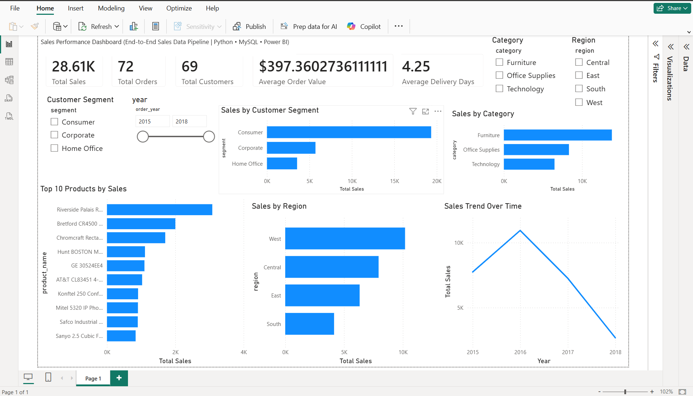

# Sales Data Pipeline

## Project Overview

An end-to-end sales data pipeline that demonstrates how raw sales data can be cleaned, transformed, loaded into a MySQL data warehouse, and analyzed through an interactive Power BI dashboard.

The project combines Python, MySQL, and Power BI into a repeatable ETL workflow suitable for analytics and data engineering use cases.

## Architecture

```text
Raw CSV
   ↓
Python / Pandas
   ↓
Data Cleaning & Transformation
   ↓
Processed CSV
   ↓
MySQL Data Warehouse
   ↓
Power BI Data Model
   ↓
Interactive Sales Dashboard
```

The ETL workflow can be executed through a single Python pipeline:

```bash
python scripts/pipeline.py
```

## Tech Stack

* Python
* Pandas
* NumPy
* SQLAlchemy
* PyMySQL
* MySQL
* Power BI
* DAX
* Git / GitHub

## Dataset

The project uses a sales dataset containing:

* 145 sales records
* 72 distinct orders
* Order dates ranging from May 13, 2015 to December 25, 2018

The dataset includes customer, product, geographic, order, shipping, and sales information.

## ETL Pipeline

### 1. Extract

The pipeline reads the raw CSV file from:

```text
data/raw/sales_data.csv
```

### 2. Transform

The Python cleaning process:

* Standardizes column names
* Converts order and shipping dates
* Converts sales values to numeric format
* Removes duplicate records
* Handles missing postal codes
* Calculates delivery days
* Extracts order year
* Extracts order month

The cleaned dataset is saved to:

```text
data/processed/clean_sales_data.csv
```

### 3. Load

The processed data is loaded into the MySQL database:

```text
sales_pipeline
```

The raw/staging table is:

```text
sales_data
```

Database credentials are stored locally in a `.env` file and excluded from GitHub through `.gitignore`.

## MySQL Data Warehouse

The project uses a star-schema-style data model consisting of:

```text
                 dim_customer
                      │
                      │
dim_date ─────── fact_sales ─────── dim_product
                      │
                      │
                 dim_location
```

### Fact Table

`fact_sales`

Contains transactional sales information including:

* Order ID
* Customer ID
* Product ID
* Order Date
* Ship Date
* Sales
* Delivery Days

### Dimension Tables

`dim_customer`

Customer and segment information.

`dim_product`

Product, category, and sub-category information.

`dim_location`

Geographic information including country, city, state, postal code, and region.

`dim_date`

Date-related attributes used for analysis.

The MySQL warehouse also includes primary keys and indexes for important lookup and filtering fields.

## Power BI Dashboard

The Power BI dashboard provides interactive sales analysis using the MySQL warehouse.



### KPI Metrics

* Total Sales
* Total Orders
* Total Customers
* Average Order Value
* Average Delivery Days

### Dashboard Visuals

* Sales Trend Over Time
* Sales by Category
* Sales by Region
* Top 10 Products by Sales
* Sales by Customer Segment

### Interactive Filters

* Year
* Region
* Category
* Customer Segment

The dashboard allows users to filter the analysis dynamically and explore sales performance across different business dimensions.

## Key Insights

Based on the current dataset:

* Furniture is the highest-sales category.
* The West region generates the highest sales among the four regions.
* Consumer is the largest customer segment by sales.
* The Riverside Palais Royal Lawyers Bookcase is the highest-selling product in the dataset, with approximately $3,083 in sales.
* Total sales are approximately $28,609.94 across the 145 sales records.

## Project Structure

```text
sales-data-pipeline-project/
│
├── dashboard/
│   └── sales_dashboard.pbix
│
├── data/
│   ├── raw/
│   │   └── sales_data.csv
│   └── processed/
│       └── clean_sales_data.csv
│
├── screenshots/
│   └── sales_dashboard.png
│
├── scripts/
│   ├── data_cleaning.py
│   ├── load_to_mysql.py
│   └── pipeline.py
│
├── .gitignore
├── requirements.txt
└── README.md
```

## How to Run

### 1. Clone the repository

```bash
git clone https://github.com/GhousiaInsights/sales-data-pipeline-project.git
cd sales-data-pipeline-project
```

### 2. Install Python dependencies

```bash
pip install -r requirements.txt
```

### 3. Configure MySQL credentials

Create a local `.env` file in the project root:

```text
MYSQL_USERNAME=root
MYSQL_PASSWORD=YOUR_PASSWORD
MYSQL_HOST=localhost
MYSQL_DATABASE=sales_pipeline
```

Do not commit the `.env` file to GitHub.

### 4. Run the ETL pipeline

```bash
python scripts/pipeline.py
```

The pipeline will:

1. Clean and transform the raw CSV
2. Save the processed dataset
3. Load the processed data into MySQL

### 5. Open the Power BI dashboard

Open:

```text
dashboard/sales_dashboard.pbix
```

Connect or refresh the Power BI model using the MySQL database.

## Security

Database credentials are stored in a local `.env` file and excluded through `.gitignore`.

No database passwords or other credentials should be committed to the repository.

## Future Improvements

Potential extensions to this project include:

* Automating scheduled pipeline execution
* Adding incremental data loading
* Adding data-quality validation
* Adding logging and error handling
* Migrating the warehouse to a cloud platform such as Azure
* Adding automated Power BI refresh
* Adding CI/CD for the pipeline

## Purpose

This project was created as a portfolio demonstration of practical skills in:

* Python ETL
* SQL
* MySQL
* Data warehousing
* Star schema modeling
* Data transformation
* DAX
* Power BI
* Git/GitHub
* Pipeline automation
